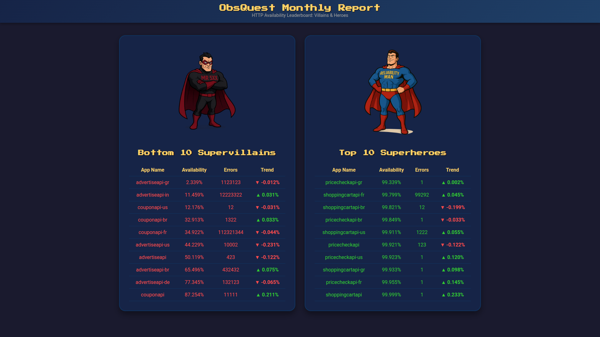

# 🦸‍♂️ ObsQuest

[](obsquest_screenshot.png)

**ObsQuest** is a lightweight Go-based dashboard designed to bring a bit of fun and visibility to site reliability engineering. It lets teams display service availability and reliability stats in a “Heroes vs Villains” style leaderboard — rewarding top-performing services and calling out the troublemakers (with love, of course).

---

## 🎯 Purpose

ObsQuest aims to make reliability data **engaging and visible**.  
Instead of endless spreadsheets or dull status charts, it turns uptime and error rates into a playful competition that sparks conversations and promotes adoption of SRE principles.

In short: **Make reliability fun again.**

---

## 🚀 Features

- Simple Go web app with templated HTML (using `html/template`)
- Displays **top 10 Heroes** (best availability) and **bottom 10 Villains** (worst availability)
- Easy to style and extend — just update the CSS or HTML templates
- Works with canned JSON data or can fetch real data from APIs
- Ready to plug into New Relic or other observability platforms

---

## 🧩 Current Architecture
```
Go Web App
├── main.go # HTTP server and template rendering
├── templates/
│ └── report.html # Go HTML template for leaderboard
├── static/
│ ├── css/
│ │ └── style.css
│ └── images/
│ ├── reliability_man.png
│ └── mr_5xx.png
└── canned.json # Example service data
```
---

## 🧠 TODO / Roadmap

1. **Integrate with New Relic API**
   - Fetch weekly/monthly availability and error count data for all OTEL-instrumented services.
   - Support authentication and configurable time ranges.

2. **Implement a Transformer Layer**
   - Convert raw New Relic API data into the internal `App` struct format.
   - Handle field normalization (availability, error counts, and calculated trends).

3. **Add Period-on-Period Comparison**
   - Store the transformed JSON in memory or a lightweight data store.
   - Compare current and previous periods to generate **trend differentials** for each service.

4. **Optional Future Additions**
   - Add badges, ranks, or achievements for services (“99.999% Club”, “5xx Slayer”, etc.).
   - Build a small REST API endpoint to expose leaderboard data.
   - Add a dark/light mode switch (because of course).

---

## 🏗️ Running the App

1. **Install dependencies and run**
   ```bash
   go run main.go

2. **Visit http://localhost:8080**

You’ll see the ObsQuest dashboard showing your **Top 10 Heroes** (best performers) and **Bottom 10 Villains** (the offenders).  
Right now it uses `canned.json` for static data — later it’ll pull directly from your observability API (e.g., New Relic).

---

## 🧩 Data Input

ObsQuest currently loads its data from `canned.json`, which contains pre-baked metrics in the following format:

```json
[
  {
    "name": "shoppingcartapi",
    "availability": 99.999,
    "errors": 1,
    "type": "Hero",
    "trend": 0.233
  }
]
```

When the API integration is ready, the transformer will convert raw telemetry data into this structure automatically — no manual editing needed.

## 💡 Philosophy

ObsQuest isn’t a replacement for your Grafana or New Relic dashboards — it’s a morale tool for engineers.
It’s meant to be a quick, visual snapshot of reliability that’s lighthearted enough to make SRE data actually fun to look at.

By surfacing both the heroes (stable services) and villains (chaotic gremlins), the goal is to:

Encourage teams to take pride in reliability wins 🦸‍♀️

Nudge owners of failing services to improve them (without shame) 😈

Foster friendly rivalry that drives adoption of SRE practices

Think of it as an observability leaderboard meets arcade cabinet.
